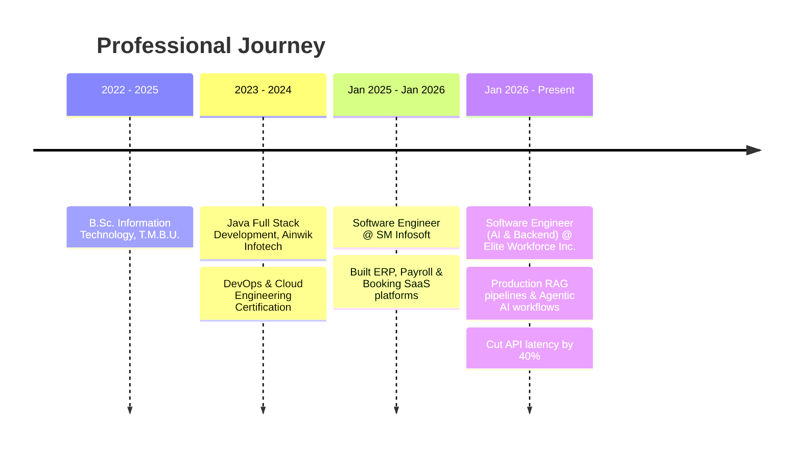

<div align="center">

<!-- Animated Waving Header -->


<!-- Typing animation -->


<br/>

<!-- Badge row -->
<a href="https://www.linkedin.com/in/sapankumar55/"></a>
<a href="mailto:ksapan73@gmail.com"></a>
<a href="https://github.com/Ksapan"></a>
<a href="https://sapan-portfolio-gfvx-468.velyf-sapans-projects-1fd4a6d7.vercel.app/"></a>

<br/><br/>

<!-- Live stat badges -->


</div>


<br/>

## 🧭 About Me

<table width="100%">
<tr>
<td width="60%" valign="top">

```yaml
whoami: Sapan Kumar
role: "AI/ML Engineer • Agentic AI & Backend Architect"
based_in: "India"
currently_building: "Production-grade Agentic AI & RAG platforms"
currently_learning: "Multi-agent orchestration @ scale, LangGraph state machines"
ask_me_about: [GenAI, RAG, LangChain, Node.js, System Design, SaaS Architecture]
fun_fact: "I ship AI agents that automate the boring parts of work — so humans don't have to."
```

I'm a Software Engineer who works at the intersection of **Generative AI** and **scalable backend architecture** — designing Agentic AI workflows, RAG pipelines, and multi-tenant SaaS platforms that go from prototype to production. I care about clean systems, fast retrieval, and AI that's actually reliable, not just a demo.

</td>
<td width="40%" align="center">

</td>
</tr>
</table>


<br/>

## ⚡ Tech Arsenal

<div align="center">

**Generative AI · Agentic Systems · RAG**


**Languages & Frontend**


**Backend & Distributed Systems**


**Databases**


**Cloud, DevOps & Tools**


</div>

<br/>

<details>
<summary><b>📊 Proficiency Breakdown (click to expand)</b></summary>
<br/>

| Domain | Proficiency |
|---|---|
| Agentic AI / LangChain / RAG Pipelines | ████████████████████░░ 90% |
| Node.js / Express.js / TypeScript | █████████████████████░ 92% |
| React.js / Next.js / Redux Toolkit | ██████████████████░░░░ 85% |
| MongoDB / PostgreSQL / Redis | ███████████████████░░░ 88% |
| Docker / AWS / CI-CD | █████████████████░░░░░ 80% |
| Python / ML Fundamentals (Pandas, Scikit-Learn) | ████████████████░░░░░░ 75% |

</details>


<br/>

## 🏗️ Featured Builds

<table width="100%">
<tr>
<td width="50%" valign="top">

### 🕵️ AI on Hunt (AOH)
**Agentic AI Talent Acquisition Platform**

Semantic search + RAG to match candidates to jobs, structured resume-to-JSON extraction, multi-tenant RBAC, and a Chrome Extension that autofills external ATS forms via backend AI APIs.

`LangChain` `OpenAI` `RAG` `pgvector` `Node.js` `React.js` `MongoDB`

</td>
<td width="50%" valign="top">

### 🦉 AutomationOwl
**AI Agent & Distributed Workflow Platform**

Multi-step AI Agent tool-calling with state + memory across sessions, Redis-backed BullMQ queues for retries/rate-limiting, Dockerized microservices on AWS EC2, event-driven webhook ingestion.

`LangGraph` `Vector DB` `Redis` `BullMQ` `Docker` `AWS EC2`

</td>
</tr>
<tr>
<td width="50%" valign="top">

### 🎤 AI Interview Prep App
**Real-Time Voice-Based AI Evaluator**

Low-latency voice pipelines with real-time speech/text models and instant analytics on soft-skills and technical accuracy.

`Next.js` `Firebase` `Voice AI` `LLM APIs`

</td>
<td width="50%" valign="top">

### 🧘 YogLiving
**Conversational AI Booking Platform**

Multi-turn LLM chatbot with context memory and guardrails, real-time slot allocation, and Razorpay webhook reconciliation.

`Next.js` `Node.js` `MongoDB` `Razorpay` `LLM Chatbot`

</td>
</tr>
<tr>
<td width="50%" valign="top">

### 🧾 Payroll & Enterprise ERP
**Automated Financial & HR Scheduler**

Statutory compliance engines (PF, PT, ESIC, TDS), geolocation attendance tracking, automated PDF payslip generation.

`React.js` `Node.js` `MongoDB` `PostgreSQL` `JWT`

</td>
<td width="50%" valign="top">

### 🚗 AI Auto Parts
**Cognitive Search E-Commerce Engine**

Vector-embedding-powered semantic search for parts discovery with granular admin catalog controls.

`Next.js` `Node.js` `MongoDB` `OpenAI`

</td>
</tr>
</table>


<br/>

## 💼 Career Timeline



<details>
<summary><b>📌 Role details (click to expand)</b></summary>

**Software Engineer (AI & Backend) — Elite Workforce Inc.** · *Jan 2026 – Present*
- Architected end-to-end production RAG pipelines for parsing, chunking, and semantic indexing of resumes
- Engineered autonomous Agentic AI workflows using LangChain function-calling for multi-step candidate evaluation
- Built scalable Node.js/TypeScript services with JWT auth, RBAC, and multi-tenant isolation
- Implemented Redis + BullMQ async worker queues for token-heavy embedding generation
- Reduced response latency by **40%** via hybrid search & caching optimization
- Containerized AI microservices with Docker, deployed on AWS EC2 behind Nginx

**Software Engineer — SM Infosoft** · *Jan 2025 – Jan 2026*
- Developed enterprise ERP, booking, and operational SaaS applications
- Engineered REST APIs for multi-user permissions and automated business logic
- Integrated Razorpay payment gateways with async webhook validation
- Built interactive React.js dashboards and optimized MongoDB/SQL schemas

</details>


<br/>

## 📈 GitHub Analytics

<div align="center">


<br/><br/>


</div>

<details>
<summary><b>🐍 Add the animated contribution snake (setup)</b></summary>

Add this GitHub Action (`.github/workflows/snake.yml`) to your profile repo to generate an animated snake that eats your contribution graph — then embed the output image below.

```yaml
name: generate snake
on:
  schedule:
    - cron: "0 0 * * *"
  workflow_dispatch: {}
  push:
    branches: [ main ]
jobs:
  generate:
    runs-on: ubuntu-latest
    steps:
      - uses: Platane/snk@v3
        with:
          github_user_name: Ksapan
          outputs: dist/snake-dark.svg?palette=github-dark
      - uses: actions/upload-pages-artifact@v2
        with:
          path: dist
  deploy:
    needs: generate
    runs-on: ubuntu-latest
    permissions:
      pages: write
      id-token: write
    steps:
      - uses: actions/deploy-pages@v3
```

Then embed it:
```md

```

</details>


<br/>

## 🎓 Education & Certifications

<div align="center">

| 🎓 Credential | Institution | Duration |
|---|---|---|
| B.Sc. Information Technology | Tilka Manjhi Bhagalpur University (T.M.B.U.) | 2022 – 2025 |
| Java Full Stack Development | Ainwik Infotech | 2023 – 2024 |
| DevOps & Cloud Engineering — Docker, Kubernetes, CI/CD | — | 2023 – 2024 |

</div>

<br/>

## 🖥️ System Terminal

<div align="center">

> *"I engineer intelligent, autonomous systems that bridge traditional SaaS architecture with production-grade Generative AI."*

</div>

```text
               .---.           OPERATOR: Sapan Kumar
              /     \          ROLE: AI/ML Engineer & Full Stack Architect
              \  O  /          KERNEL: LangChain / LangGraph / Node.js Engine
        _..__  `---'           UPTIME: 24/7 Autopilot
      .'     `-.               ENV: AWS · Docker · Nginx · CI/CD
     /          \              AI_BRAIN: GPT-4o · Claude · Gemini 1.5 Pro
    |   Ksapan   |             VECTORS: Pinecone · ChromaDB · Qdrant · pgvector
    |            |             FOCUS: Agentic AI, RAG Pipelines & Scalable SaaS
     \          /
      `._    _.'               LANGUAGES: JS · TS · Python · Java · SQL · Bash
         `---'                 DATABASES: MongoDB · PostgreSQL · MySQL · Redis
```

```javascript
const currentTask = {
  ai_ml: ["LangChain", "LangGraph", "RAG Pipelines", "Vector Search", "Prompt Engineering"],
  backend: ["Node.js", "Express.js", "TypeScript", "Microservices", "BullMQ"],
  frontend: ["React.js", "Next.js", "Redux Toolkit", "Tailwind CSS"],
  cloud: ["AWS EC2/S3", "Docker", "Nginx", "CI/CD"],
  status: "EXECUTING_AUTOMATION_QUEUES..."
};
```


<br/>

## 🌐 Let's Connect

<div align="center">

<a href="mailto:ksapan73@gmail.com"></a>
<a href="https://github.com/Ksapan"></a>
<a href="https://www.linkedin.com/in/sapankumar55/"></a>
<a href="https://sapan-portfolio-gfvx-468.velyf-sapans-projects-1fd4a6d7.vercel.app/"></a>
<a href="tel:+919631705894"></a>

<br/><br/>

### 🚀 Designing and deploying the intelligent, autonomous systems of tomorrow.


</div>
